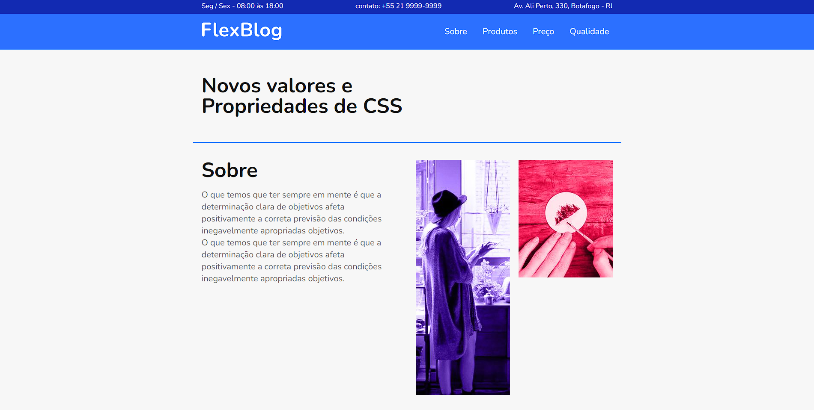

<h1 align="center" >FlexBlog - Curso de flexbox</h1>

Este é um projeto simples de blog com apenas a home criado pela Origamid no curso "CSS Flexbox"

## </> **Tecnologias usadas**

As principais tecnologias usadas nesse projeto:

`HTML`

`CSS`

## 📖 **Descrição do Projeto**

Este curso é focado em usar apenas flexbox e usar todas as suas funcionalidades.

## 🔗 **Links**

- Aqui está o site original - https://www.origamid.com/projetos/flexblog/
- Github pages - https://gustavogularte.github.io/projeto-flexblog
- Linkedin - https://www.linkedin.com/in/gustavo-gularte-58742a286
- Meu Twitter - https://twitter.com/gustavoGulArend
- Meu perfil no Front End Mentor com mais desafios - https://www.frontendmentor.io/profile/gustavogularte