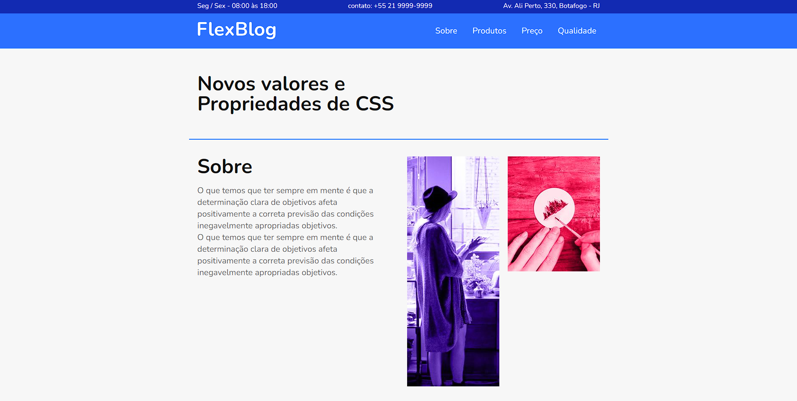

<h1 align="center">📐 Flexblog - CSS Flexbox | Origamid</h1>

  Projeto desenvolvido durante o curso <strong>CSS Flexbox</strong> da Origamid.

  

  
  
  
  
  

---

# 📖 Sobre

O **Flexblog** é um projeto desenvolvido durante o curso **CSS Flexbox** da Origamid com o objetivo de aplicar, na prática, os principais conceitos do **Flexbox** na construção de um layout moderno e totalmente responsivo.

Todo o posicionamento da interface foi construído utilizando Flexbox, demonstrando como esse modelo de layout pode ser utilizado para criar páginas organizadas, flexíveis e adaptáveis a diferentes tamanhos de tela.

---

# ✨ Funcionalidades

- ✅ Layout totalmente responsivo
- ✅ Estrutura semântica em HTML5
- ✅ Posicionamento utilizando Flexbox
- ✅ Organização de componentes da página
- ✅ Seções de conteúdo
- ✅ Galeria de informações
- ✅ Design moderno
- ✅ Código organizado e de fácil manutenção

---

# 🛠 Tecnologias

  
  
  

---

# 🎯 Objetivo

Este projeto foi desenvolvido com o objetivo de consolidar os conhecimentos adquiridos durante o curso **CSS Flexbox** da Origamid, colocando em prática técnicas de construção de layouts responsivos utilizando apenas HTML e CSS.

---

# 📸 Preview

  

---

# 🔗 Links

- 🌐 **Deploy:** https://gustavogularte.github.io/projeto-flexblog/
- 💼 LinkedIn: https://www.linkedin.com/in/gustavo-gularte-arend-58742a286/
- 🌐 Meu perfil no Frontend Mentor: https://www.frontendmentor.io/profile/gustavogularte
